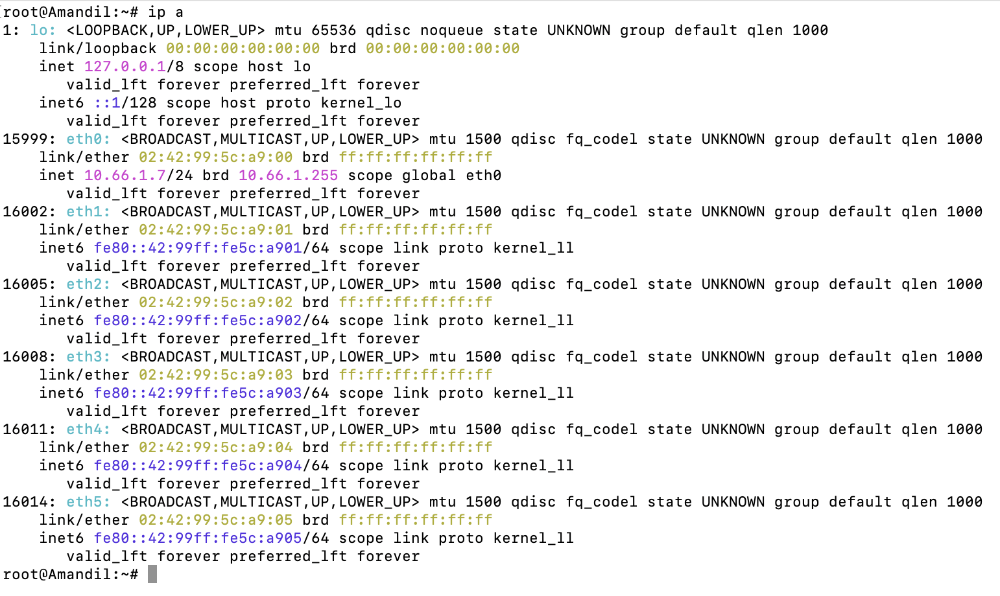
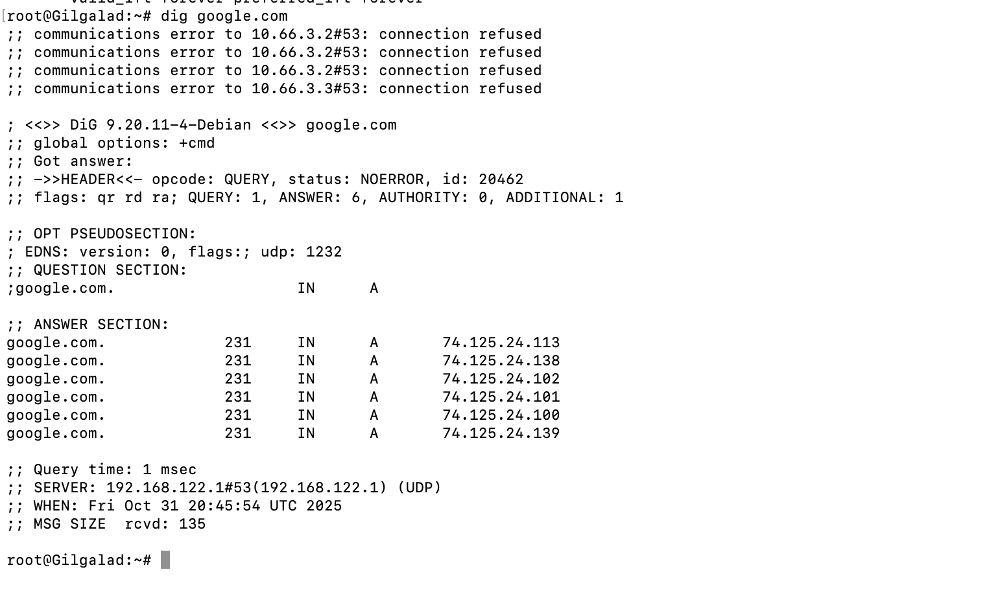
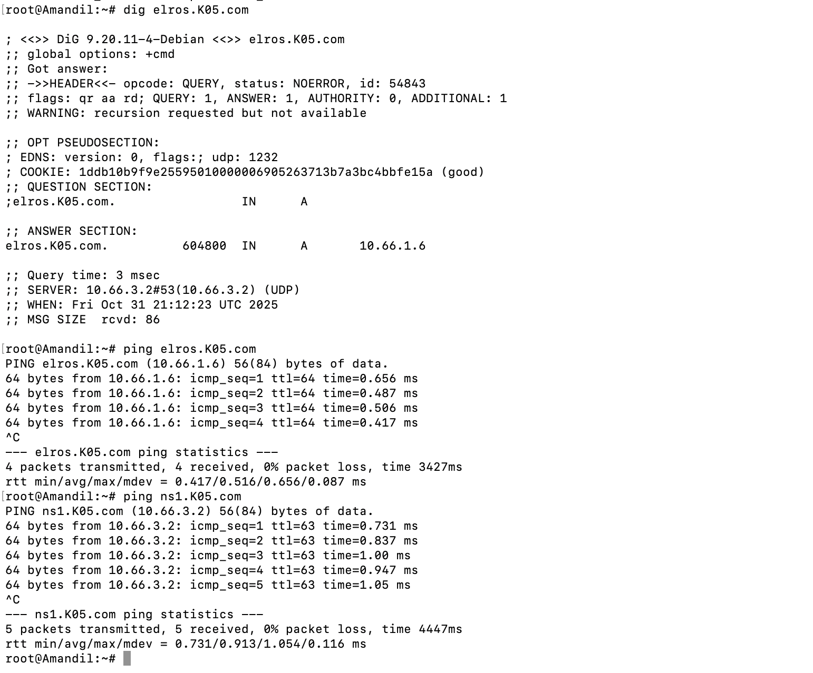
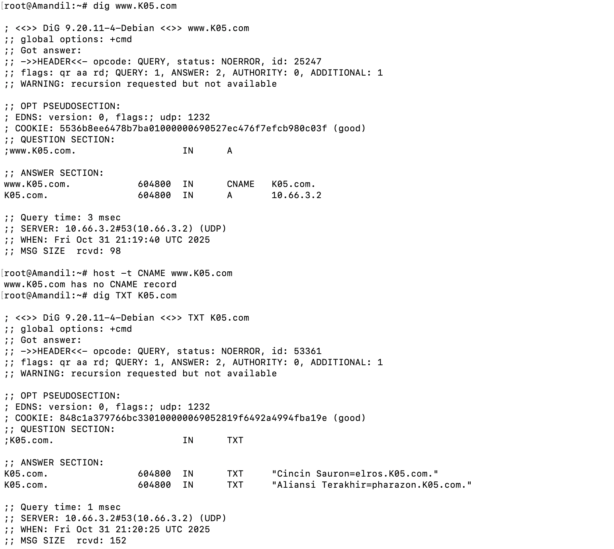
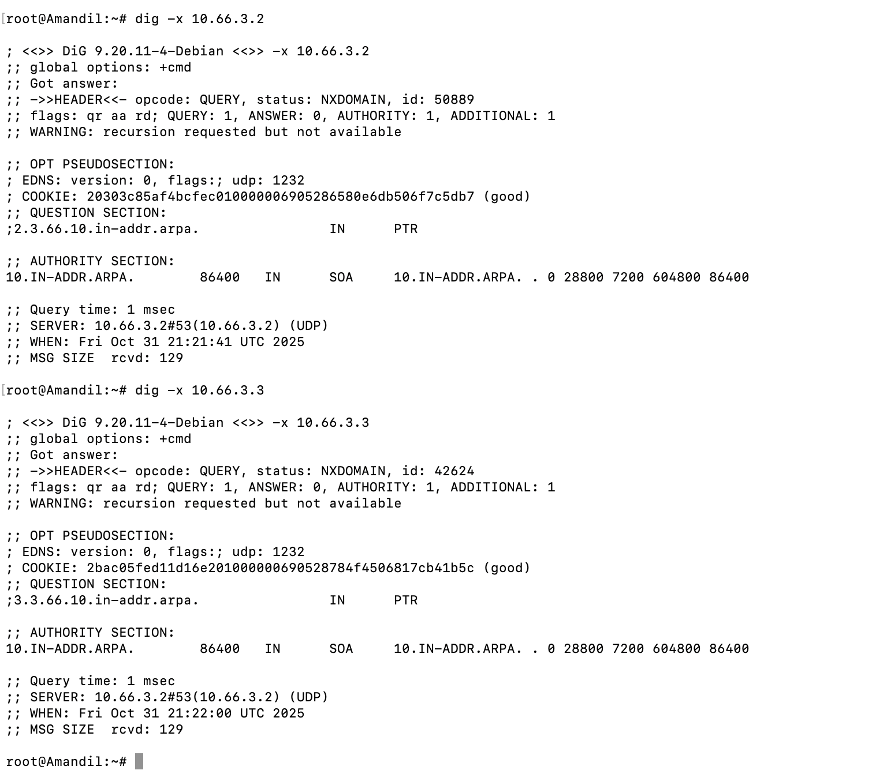
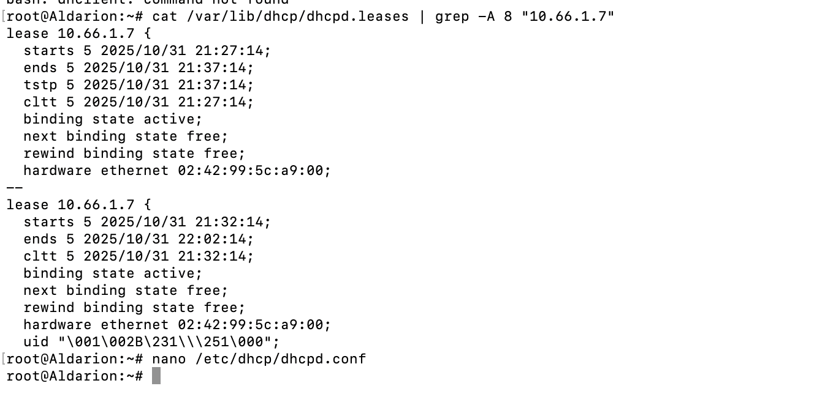
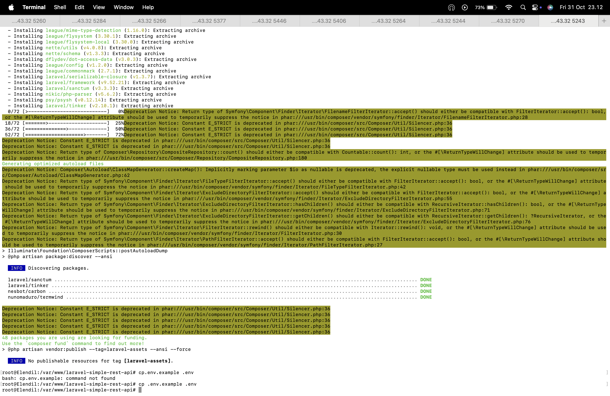

# Jarkom-Modul-3-2025-K-05
|No|Nama anggota|NRP|
|---|---|---|
|1. | Adiwidya Budi Pratama | 5027241012|
|2. | Ni'mah Fauziyyah Atok | 5027241103|
---
# 📚 Laporan Praktikum Jaringan Komputer - Modul 3

Laporan ini mencakup implementasi dan verifikasi layanan jaringan krusial, yaitu **DHCP Server & Relay**, **Caching DNS Forwarder**, **Master/Slave DNS Server (BIND9)**, dan **Persiapan Aplikasi (Laravel Worker)**.

---

## 2. 🌍 Konfigurasi DHCP Server dan DHCP Relay

### 2.1. Aldarion (DHCP Server)

Konfigurasi server DHCP yang bertanggung jawab mendistribusikan alamat IP otomatis untuk seluruh subnet melalui DHCP Relay.

#### 🛠️ Langkah Konfigurasi Aldarion

1.  **Instalasi:**
    ```bash
    apt update
    apt install isc-dhcp-server
    dhcpd --version
    ```
2.  **Penentuan Interface (`/etc/default/isc-dhcp-server`):**
    ```bash
    INTERFACESv4="eth0"
    INTERFACESv6=""
    ```
3.  **Konfigurasi Subnet (`/etc/dhcp/dhcpd.conf`):**
    * **Opsi Global:** `option domain-name-servers 10.66.3.2, 10.66.3.3;`
    * **Manusia (10.66.1.0/24):** Range `10.66.1.6 - .34` dan `10.66.1.68 - .94`. Router `10.66.1.1`.
    * **Peri (10.66.2.0/24):** Range `10.66.2.35 - .67` dan `10.66.2.96 - .121`. Router `10.66.2.1`.
    * **Fixed IP Khamul:** `10.66.3.95` (MAC: `02:42:c4:30:99:00`).
4.  **Restart Layanan:** `service isc-dhcp-server restart`

### 2.2. Durin (DHCP Relay)

Konfigurasi relay yang meneruskan permintaan DHCP dari subnet lain ke Aldarion (DHCP Server).

#### 🛠️ Langkah Konfigurasi Durin

1.  **Instalasi dan Konfigurasi Server Tujuan (`/etc/default/isc-dhcp-relay`):**
    ```bash
    apt install isc-dhcp-relay
    SERVERS="10.66.4.2" # IP Aldarion di subnet database (4.0/24)
    INTERFACES="eth1 eth2 eth3 eth4 eth5"
    ```
2.  **Aktivasi IP Forwarding:**
    ```bash
    echo "net.ipv4.ip_forward=1" >> /etc/sysctl.conf
    sysctl -p
    ```
3.  **Restart Layanan:** `service isc-dhcp-relay restart`

#### 📸 Bukti: Verifikasi Alamat IP Klien
* **Amandil** (Manusia): IP **10.66.1.7**
  
* **Gilgalad** (Peri): IP **10.66.2.35**
* 
* **Khamul**: IP **10.66.3.95** (Fixed IP)
* 

---

## 3. 🌐 Konfigurasi Caching DNS Forwarder (Minastir)

Minastir dikonfigurasi sebagai *Forwarder* murni untuk meneruskan semua *query* ke DNS eksternal (Internet).

#### 🛠️ Langkah Konfigurasi Minastir

1.  **Instalasi BIND9:** `apt-get install -y bind9`
2.  **Konfigurasi (`/etc/bind/named.conf.options`):**
    ```bash
    options {
        allow-query { 10.66.0.0/16; }; # Izinkan query dari semua internal
        forwarders { 192.168.122.1; }; # DNS NAT GNS3
        forward only;
        # ...
    };
    ```
3.  **Restart Layanan:** `service bind9 restart`

#### 📸 Bukti: Pengujian Forwarder


---

## 4. 🏰 Konfigurasi Master/Slave DNS Server (Erendis dan Amdir)

### 4.1. Erendis (Master DNS - 10.66.3.10)

Erendis adalah Master DNS untuk zona `K05.com` dan *Conditional Forwarder* ke Minastir.

#### 🛠️ Langkah Konfigurasi Erendis

1.  **Instalasi BIND9 & Tools:** `apt install bind9 dnsutils lynx nginx ... -y`
2.  **Forwarder/Resolver Options (`/etc/bind/named.conf.options`):** Forwarding ke `10.66.5.2` (Minastir). **JANGAN** menggunakan `forward only;`.
3.  **Definisi Master Zone (`/etc/bind/named.conf.local`):**
    ```bash
    zone "K05.com" {
        type master;
        notify yes;
        also-notify { 10.66.3.3; };
        allow-transfer { 10.66.3.3; };
        file "/etc/bind/K05/db.K05.com";
    };
    ```
4.  **Forward Zone File (`/etc/bind/K05/db.K05.com`):** Berisi SOA, NS, A Records (ns1, ns2, palantir, elros, pharazon, dll.).
5.  **Restart Layanan:** `service bind9 restart`

### 4.2. Amdir (Slave DNS - 10.66.3.11)

Amdir dikonfigurasi sebagai Slave DNS yang menyalin data zona dari Erendis (Master).

#### 🛠️ Langkah Konfigurasi Amdir

1.  **Instalasi BIND9 & Tools:** Sama seperti Erendis.
2.  **Forwarder/Resolver Options (`/etc/bind/named.conf.options`):** Sama seperti Erendis.
3.  **Definisi Slave Zone (`/etc/bind/named.conf.local`):**
    ```bash
    zone "K05.com" {
        type slave;
        masters { 10.66.3.10; }; # Master: Erendis
        file "/var/cache/bind/db.K05.com";
    };
    ```
4.  **Restart Layanan:** `service bind9 restart`

#### 📸 Bukti: Pengujian Resolusi 


## 5. ✍️ Konfigurasi CNAME, TXT, dan Reverse DNS (PTR)

### 5.1. CNAME dan TXT Records (Erendis)

Tambahan Record di `db.K05.com`:
* **CNAME:** `www IN CNAME K05.com.`
* **TXT Records (Pesan Rahasia):**
    * `@ IN TXT "Cincin Sauron=elros.K05.com."`
    * `@ IN TXT "Aliansi Terakhir=pharazon.K05.com."`

#### 📸 Bukti: Pengujian CNAME dan TXT


### 5.2. Reverse DNS (PTR)

Konfigurasi untuk resolusi IP ke Nama Domain pada jaringan 10.66.3.0/24.

#### 🛠️ Langkah Konfigurasi PTR

1.  **Erendis (Master):** Tambahkan *Reverse Zone* `3.66.10.in-addr.arpa` di `named.conf.local` dan buat file `db.10.66.3` berisi PTR Records untuk ns1 dan ns2.
2.  **Amdir (Slave):** Tambahkan *Slave Reverse Zone* di `named.conf.local`:
    ```bash
    zone "3.66.10.in-addr.arpa" {
        type slave;
        masters { 10.66.3.10; };
        file "/var/cache/bind/db.10.66.3";
    };
    ```

#### 📸 Bukti: Pengujian Reverse DNS


---

## 6. ⏱️ Revisi Konfigurasi DHCP Lease Time (Aldarion)

Dilakukan penyesuaian waktu *default* dan *max lease time* per subnet.

#### 🛠️ Langkah Revisi DHCP

1.  **Edit `/etc/dhcp/dhcpd.conf` di Aldarion.**
    * **Global:** `max-lease-time 3600;` (1 jam).
    * **Manusia (10.66.1.0/24):** `default-lease-time 1800;` (30 menit).
    * **Peri (10.66.2.0/24):** `default-lease-time 600;` (10 menit).
2.  **Restart Layanan:** `service isc-dhcp-server restart`

#### 📸 Bukti: Lease Time yang Diperbarui


---

## 7. 💻 Instalasi Laravel Worker (Elendil, Isildur, Anarion)

Persiapan lingkungan untuk menjalankan aplikasi PHP Laravel pada *worker* Elendil, Isildur, dan Anarion.

#### 🛠️ Langkah Instalasi Laravel Worker

1.  **Konfigurasi DNS Klien (`/etc/resolv.conf`):** Diarahkan ke DNS Lokal (10.66.3.10, 10.66.3.11) dan Forwarder (10.66.5.2).
2.  **Instalasi PHP 8.4 dan Ekstensi Wajib:** Melalui repository **Sury** (diperlukan `apt update`, instalasi *keyring*, dan penambahan `sources.list.d`).
    ```bash
    apt-get install -y php8.4-mbstring php8.4-xml php8.4-cli php8.4-mysql php8.4-fpm php8.4-curl
    ```
3.  **Instalasi Nginx, MariaDB Client, dan Tools:** `apt-get install -y nginx mariadb-client dnsutils lynx htop`
4.  **Instalasi Composer:** Download dan pindahkan `composer.phar` ke `/usr/bin/composer`.
5.  **Setup Aplikasi Laravel (`/var/www/laravel-simple-rest-api`):**
    ```bash
    cd /var/www
    git clone [https://github.com/elshiraphine/laravel-simple-rest-api](https://github.com/elshiraphine/laravel-simple-rest-api) .
    cd laravel-simple-rest-api
    composer update --no-dev
    cp .env.example .env
    ```

#### 📸 Bukti: Verifikasi Instalasi Laravel


---
